# Part 2: Developing and Deploying Spark Jobs in CDE

## Objective

In this section you will create four Spark jobs using the CDE UI, the CDE CLI and CDE Interactive Sessions. In the process you learn how to use CDE Resources to store files and reuse Python virtual environments, migrate Spark tables to Iceberg tables, and use some of Iceberg's most awaited features including Time Travel, Incremental Queries, Partition and Schema Evolution.

### Editing Files and Creating CDE Resources

CDE Resources can be of type "File", "Python", or "Custom Runtime". You will start by creating a resource of type file to store all Spark and Airflow files and dependencies and then a Python Resource to utilize custom Python libraries in a CDE Spark Job run.

To create a File Resource, from the CDE Home Page click on "Create New" in the "Resources" -> "File" section.

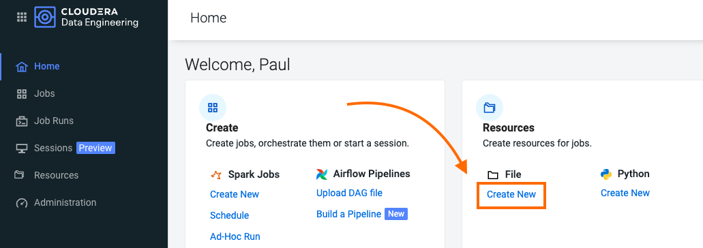

Pick your Spark 3 / Iceberg enabled CDE Virtual Cluster and name your Resource after your username or a unique ID.

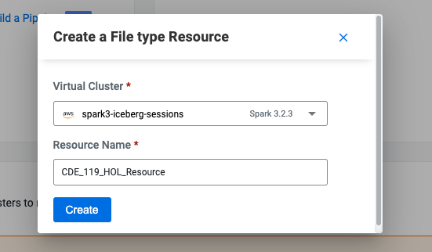

Upload the following files located in the "cde_ace_hol/cde_spark_jobs" and "cde_ace_hol/resources_files" folders.

When you have finished ensure that the following files are located in your File Resource:

```
01_PySpark_ETL.py
simple_udf.zip
simple_udf_dependency.py
parameters.conf
utils.py
```

To create a Python Resource, navigate back to the CDE Home Page and click on "Create New" in the "Resources" -> "Python" section.


Ensure to select the same CDE Virtual Cluster. Name the Python CDE Resource and leave the pipy mirror field blank.

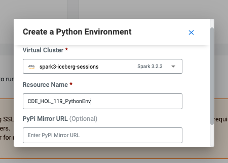

Upload the "requirements.txt" file provided in the "cde_ace_hol/resources_files" folder.

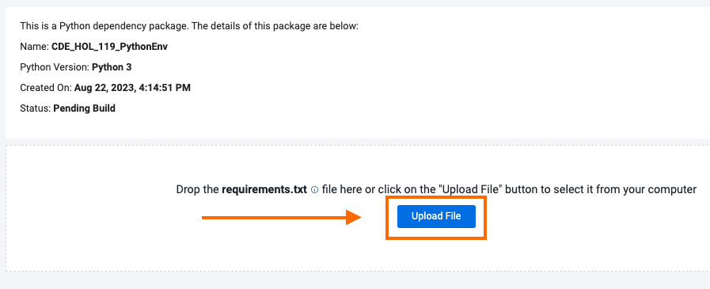

Notice the CDE Resource is now building the Python Virtual Environment. After a few moments the build will complete and you will be able to validate the libraries used.

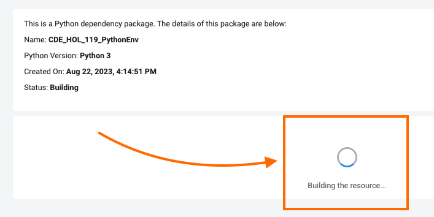


To learn more about CDE Resources please visit [Using CDE Resources](https://docs.cloudera.com/data-engineering/cloud/use-resources/topics/cde-python-virtual-env.html) in the CDE Documentation.

### Creating CDE Spark Jobs in the UI

Next we will run and deploy a Spark script as a CDE Job of type Spark using the "01_PySpark_ETL.py" script. Navigate back to the CDE Home Page. Click on "Create New" in the "Jobs" -> "Spark" section.

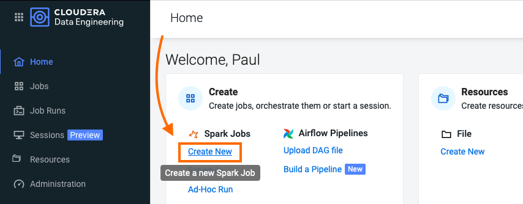

#### 1. Set Job Name, Virtual Cluster and Application File

Select your CDE Virtual Cluster and assign "O1_ETL" as the Job Name. Append your name to distinguish your job's name from others'.


The Application File is the code that will run as the Spark Job. This could be a PySpark file or a Jar.

Because you already uploaded the script to the CDE File Resource in the prior step this can be easily selected in the Job Configuration build: ensure to select "File" from the radio button and click on "Select from Resource" in the "Application File" section. A window will open with the contents loaded in your File Resource. Select script "01_PySpark_ETL.py".


#### 2. Set Spark Configurations

The Configurations section allows you to set Spark Application Configurations such as Driver and Executor settings, Jars, Spark properties, and many more. In other words, virtually most properties available in the [Spark Configurations Documentation](https://spark.apache.org/docs/latest/configuration.html) can be applied here.

In this job we will set the "spark.executorEnv.PYTHONPATH" configuration to "/app/mount/simple_udf.zip" so it can read the UDF from the CDE File Resource.


#### 3. Set Python Environment

Set the Python environment to the CDE Python Resource you created in the previous step.


#### 4. Set Advanced Options

The Python, Egg, Zip Files section allows you to load dependencies onto your job. This can be used for a variety of use cases including mounting Python files to the Executors, using Wheel files, and more.

In the Python, Egg, Zip Files section select the "utils.py" and "simple_udf.zip" file dependencies to load the UDF to the Spark Job. Notice the files have already been uploaded to the File Resource so you just need to select them from there.


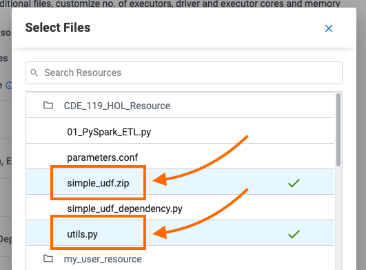

Scroll down again to the "Resources" section and notice that your File Resource has been mapped to the Job by default. This allows the PySpark script to load modules in the same Resource such as the ones contained in the "utils.py" file.


#### 5. Set Compute Options

Compute Options allow you to set important Spark Resource Configs.

* The Executors toggle bar allows you to set the "spark.dynamicAllocation.minExecutors" and "spark.dynamicAllocation.maxExecutors" options. These determine how many executors will be deployed by Spark Dynamic Allocation. Spark Dynamic Allocation is overridden to "Enabled" by default in CDE.
* The Initial Executors bar allows you to set the "spark.dynamicAllocation.initialExecutors" property. The option sets the initial number of executors for dynamic allocation. We recommend ensuring this is not set too high, especially to a value that is above the Job's expected number of Executors.
* Driver Cores and Driver Memory allow you to set "spark.driver.cores" and "spark.driver.memory". Increasing Driver Cores and Memory can be useful when your queries compile slowly or in case you call lots of collect() or take(N) actions especially on large RDD's.
* Executor Cores and Executor Memory allow you to set "spark.executor.cores" and "spark.executor.memory". These properties are used heavily in the context of Spark Tuning as they provide you with the ability to influence the degree of parallelism and storage capacity available in each Executor.

Set "Executors" to a minimum of 1 and a maximum of 4. Then set Executor Cores to 2, Driver Memory to 2, and Executor Memory to 2. This allows you to deploy a Spark Application with Executors that are slightly more resourceful than the values set in the default configurations, which often can result in Executors that are too small.


#### 6. Trigger and Monitor the Job

Scroll to the bottom and click on the "Create and Run" blue icon.


You will be automatically taken to the Jobs tab where the Job will now be listed at the top. Open the Job Runs tab on the left pane and validate that the CDE Spark Job is executing.


When complete, a green checkmark will appear on the left side. Click on the Job Run number to explore further.


The Job Run is populated with Metadata, Logs, and the Spark UI. This information is persisted and can be referenced at a later point in time.

The Configuration tab allows you to verify the script and resources used by the CDE Spark Job. From here you can edit the Configuration to change files, dependencies, run schedule, and more. For example the developer can reuse an existing job (or optionally create a clone) and make changes to its dependencies, schedule, etc. from the UI.

This also serves as an important CDE Observability feature. CDE maintains a historical trail of all runs and the respective job configurations associated with them. In other words, in traditional clusters when a Spark Job fails the developer had to manually investigate logs or, in a best case scenario, maintain DevOps processes to back up logs and runs. In CDE all of this is done automatically.   


The Logs tab contains rich logging information. For example, you can verify code output under "Logs" -> "Driver" -> "StdOut".

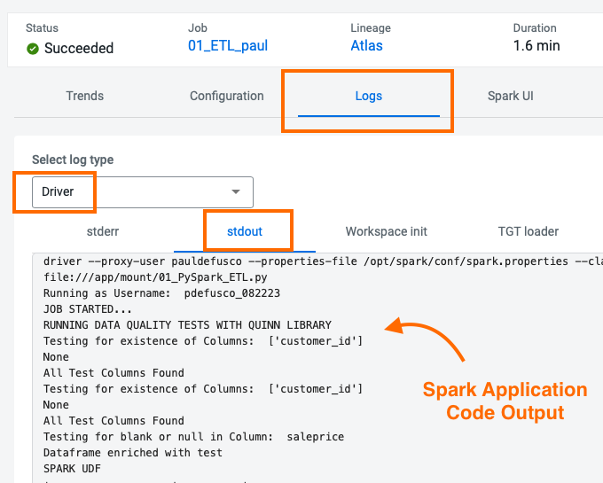

The Spark UI allows you to visualize resources, optimize performance and troubleshoot your Spark Jobs.


### Creating CDE Spark Jobs with the CLI

So far we have created a Spark Job via the CDE UI. However, CDE use cases involving more than just a few jobs normally benefit in numerous ways from the CDE CLI or CDE API. The CLI allows you to more quickly iterate through different Spark Submits and CDE Resources. The API is an excellent access point to CDE from other tools including 3rd party DevOps and CI/CD solutions.

In this section we will create a CDE Spark Submit and a CDE Spark Job via the CLI. In the process we will explain the difference.

#### 0. Installing the CDE CLI

Step 1: Download the CLI Client:

    * Navigate to the Cloudera Data Engineering Overview page by clicking the Data Engineering tile in the Cloudera Data Platform (CDP) management console.
    * In the CDE web console, select an environment.
    * Click the Cluster Details icon for the virtual cluster you want to access.
    * Click the link under CLI TOOL to download the CLI client.
    * Change the permissions on the downloaded cde file to make it executable:

Step 2: Determine the Virtual Cluster Endpoint URL:

    * Navigate to the Cloudera Data Engineering Overview page.
    * In the Environments column, select the environment containing the virtual cluster you want to access using the CLI.
    * In the Virtual Clusters column on the right, click the Cluster Details icon for the virtual cluster you want to access.
    * Click JOBS API URL to copy the URL to your clipboard.

Step 3: On the host with the CLI client, create or edit the configuration file at ```~/.cde/config.yaml```. You can create multiple profiles in the ```~/.cde/config.yaml``` file and can be used while running commands.

Step 4: In the configuration file, specify the CDP user and virtual cluster endpoint as follows. The CDP user is your workload username:

```
user: <CDP_user>
vcluster-endpoint: <CDE_virtual_cluster_endpoint>
```

Step 5: Save the configuration file. If you have not done so already, make sure that the cde file is executable by running ```chmod +x /path/to/cde```. Finally, run ```cde job list``` from your terminal to verify your configuration. Enter your workload password when prompted.

For further information on the CLI please visit the [CDE Documentation](https://docs.cloudera.com/data-engineering/cloud/cli-access/topics/cde-cli.html)


#### 1. CDE Spark Submit via the CDE CLI.

A CDE Spark Submit is the fastest way to prototype a Spark Job. It allows you to submit Spark Application Code and monitor results with CDE's logging and observability features but it does not allow you to save the Code as a reusable CDE Job Definition. This is beneficial for example in case you want to reschedule the job to run on a recurrent basis or include it in a CDE Airflow Job.

Start with a simple Spark Submit by running the following command in your terminal:

```
cde spark submit cde_spark_jobs/simple-pyspark-sql.py
```

Shortly after running this you will notice confirmation of sibmission in the terminal. As the Spark Application runs the terminal will show logs and job outputs.


The above created a "cli-submit-username-timestamp" entry in the Job Runs page of your CDE Cluster. Open the Job Run and explore the logs. Notice the Job Definition is not reusable.


The first Spark Submit ran a simple PySpark job but notice we didn't specify any Spark Options. Next, create a more advanced Spark Submit by running the following command in your terminal:

```
cde spark submit --py-files cde_spark_jobs/dist/mywheel-0.0.1-py3-none-any.whl cde_spark_jobs/mywheel/__main__.py --executor-cores 2 --executor-memory 2g
```

The above CDE Spark Submit ran with Spark Application code packaged in a Wheel file. Notice that the CDE Spark Submit included the ```--py-files```, ```--exeutor-cores``` and ```--executor-memory``` flags. These correspond to the same options available for a Spark Submit. For more on building Spark Submits commands, please visit the [Spark Documentation](https://spark.apache.org/docs/latest/submitting-applications.html)


#### 2. CDE Spark Job via the CDE CLI.

Similar to a CDE Spark Submit a CDE Spark Job is Application code to execute a Spark (or Airflow) Job in a CDE Virtual Cluster. However, the CDE Job allows you to easily define, edit and reuse configurations and resources in future runs. Jobs can be run on demand or scheduled. An individual job execution is called a Job Run.

A CDE Job of type Spark always requires a reference CDE Resource in order to mount Application Code and any dependencies. Therefore, start by creating a CDE Resource of type File:

```
cde resource create --name my_user_resource
```

Upload Application Code to the Resource:

```
cde resource upload --name my_user_resource --local-path cde_spark_jobs/cdejobjar_2.12-1.0.jar
```


Now create a CDE Job of type Spark mounting the uploaded Resource files:

```
cde job create \
  --name my-cde-job \
  --type spark \
  --mount-1-resource my_user_resource \
  --application-file cdejobjar_2.12-1.0.jar \
  --conf spark.sql.shuffle.partitions=10 \
  --executor-cores 2 \
  --executor-memory 2g
```

As before, notice Spark Configurations such as ```--executor-cores```, ```--executor-memory```, or ```spark.sql.shuffle.partitions=10``` via the ```--conf``` flag can be applied to the CDE Job.

Finally, run the Job :

```cde job run --name my-cde-job```

Notice the Job Run ID output to the terminal and validate the Job in the Job Runs page of your cluster.


Navigate to the Jobs page in your CDE Virtual Cluster and open the Job. Notice that the Definition can be edited and is reusable.


### Exploring Data Interactively with CDE Sessions

A CDE Session is an interactive short-lived development environment for running Spark commands to help you iterate upon and build your Spark workloads. You can launch CDE Sessions in two ways: from the CDE UI and from your termianl with the CLI.

##### Using Interactive Sessions in the CDE UI

From the CDE Landing Page open "Sessions" on the left pane and then select the CDE Virtual Cluster where you want to run your CDE Interactive Session.

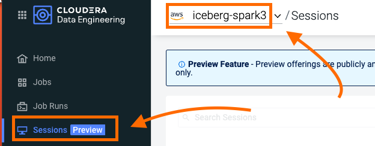


The session will be in "starting" state for a few moments. When it's ready, launch it and open the Spark Shell by clicking on the "Interact" tab.

Copy and paste the following code snippets in each cell and observe the output (no code changes required).

>**Note**  
>CDE Sessions do not require creating the SparkSession object. The shell has already been launched for you. However, if you need to import any types or functions you do have to import the necessary modules.

Import PySpark:

```
from pyspark.sql.types import Row, StructField, StructType, StringType, IntegerType
```

Create a list of Rows. Infer schema from the first row, create a DataFrame and print the schema:

```
rows = [Row(name="John", age=19), Row(name="Smith", age=23), Row(name="Sarah", age=18)]
some_df = spark.createDataFrame(rows)
some_df.printSchema()
```

Create a list of tuples:

```
tuples = [("John", 19), ("Smith", 23), ("Sarah", 18)]
```

Create a Spark schema with two fields - person_name and person_age

```
schema = StructType([StructField("person_name", StringType(), False),
                    StructField("person_age", IntegerType(), False)])
```

Create a DataFrame by applying the schema to the RDD and print the schema

```
another_df = spark.createDataFrame(tuples, schema)
another_df.printSchema()
```

Iterate through the Spark Dataframe:

```
for each in another_df.collect():
    print(each[0])
```


##### Using Interactive Sessions with the CDE CLI

You can interact with the same CDE Session from your local terminal using the ```cde sessions interact``` command.

Open your terminal and enter ```cde session interact --name InteractiveSession```. You will be prompted for your password and then the SparkShell will launch.

Run the same PySpark code into the shell.


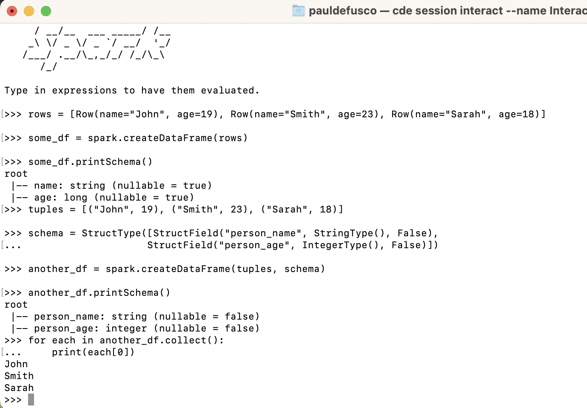

Navigate back to the CDE Session and validate that the code has run from the UI.

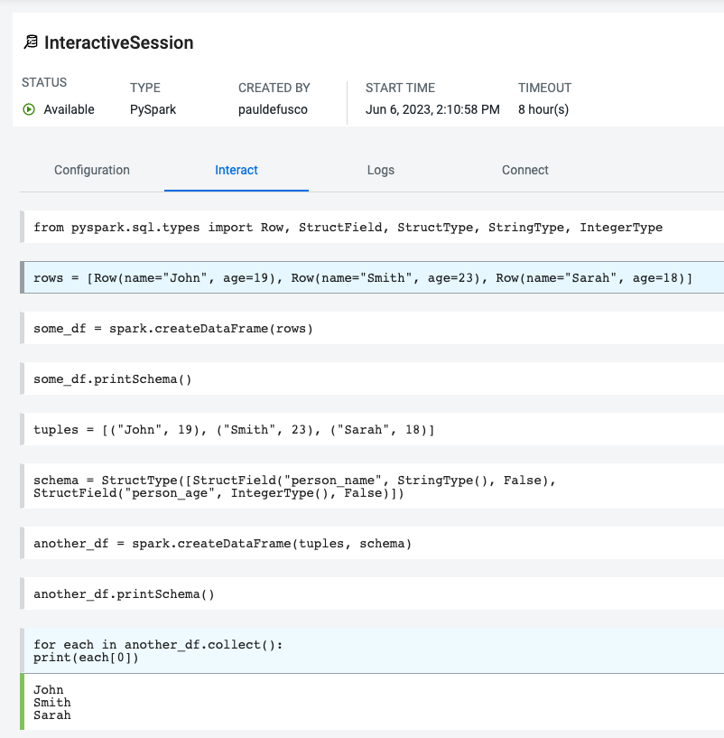

You can also create a session directly from the CLI. In your local terminal, exit out of your current Spark Shell with "ctrl+D" and then run the following command:

```cde session create --name cde_shell_from_cli --type spark-scala --description launched-from-cli --executor-cores 4 --num-executors 2```.

Notice that you can pass CDE Compute Options such as number of executors and executor-cores when using the command.


### Creating a CDE Spark Job with Apache Iceberg

In this final section of Part 2 you will finish by deploying a CDE Job of type Spark in the CDE UI using PySpark script "03_PySpark_Iceberg.py".

The script includes a lot of Iceberg-related code. Open it in your editor of choice and familiarize yourself with the code. In particular, notice:

* Lines 62-69: The SparkSession must be launched with the Iceberg Catalog. However, no Jars need to be referenced. These are already available as Iceberg is enabled at the CDE Virtual Cluster level. The Iceberg Catalog replaces the Hive Metastore for tracking table metadata.     

```
spark = SparkSession \
    .builder \
    .appName("ICEBERG LOAD") \
    .config("spark.sql.catalog.spark_catalog", "org.apache.iceberg.spark.SparkSessionCatalog")\
    .config("spark.sql.catalog.spark_catalog.type", "hive")\
    .config("spark.sql.extensions", "org.apache.iceberg.spark.extensions.IcebergSparkSessionExtensions")\
    .config("spark.yarn.access.hadoopFileSystems", data_lake_name)\
    .getOrCreate()
```

* Lines 82 - 98: You can migrate a Spark Table to Iceberg format with the "ALTER TABLE" and "CALL" SQL statements as shown below.

```
spark.sql("ALTER TABLE CDE_WORKSHOP.CAR_SALES_{} UNSET TBLPROPERTIES ('TRANSLATED_TO_EXTERNAL')".format(username))

spark.sql("CALL spark_catalog.system.migrate('CDE_WORKSHOP.CAR_SALES_{}')".format(username))

```

* Lines 125-126: Iceberg allows you to query Table metadata including history of changes and table snapshots.

```
spark.read.format("iceberg").load("spark_catalog.CDE_WORKSHOP.CAR_SALES_{}.history".format(username)).show(20, False)

spark.read.format("iceberg").load("spark_catalog.CDE_WORKSHOP.CAR_SALES_{}.snapshots".format(username)).show(20, False)
```

* Lines 146 and 150: You can create/update/append Iceberg tables from a Spark Dataframe via the Iceberg Dataframe API "writeTo" command.
At line 146 we append the Dataframe to the pre-existing table.
At line 150 we create a new Iceberg table from the Spark Dataframe.

```
temp_df.writeTo("spark_catalog.CDE_WORKSHOP.CAR_SALES_{}".format(username)).append()

temp_df.writeTo("spark_catalog.CDE_WORKSHOP.CAR_SALES_SAMPLE_{}".format(username)).create()
```

* Line 171: You can query tables as of a particular timestamp or snapshot. In this case we use the timestamp. This information is available in the history and snapshots table we queries at lines 125-126. The metadata tables are updated in real time as tables are modified.

```
df = spark.read.option("as-of-timestamp", int(timestamp*1000)).format("iceberg").load("spark_catalog.CDE_WORKSHOP.CAR_SALES_{}".format(username))
```

* Lines 193-197: You can query Iceberg table by selecting only data that has changed between two points in time or two snaphots. This is referred to as an "Iceberg Incremental Read".

```
spark.read\
    .format("iceberg")\
    .option("start-snapshot-id", first_snapshot)\
    .option("end-snapshot-id", last_snapshot)\
    .load("spark_catalog.CDE_WORKSHOP.CAR_SALES_{}".format(username)).show()
```

* Lines 234-251: While Spark provides partitioning capabilities, once a partitioning strategy is chosen the only way to change it is by repartitioning or in other words recomputing all table / dataframe partitions.

Iceberg introduces Partition Evolution i.e. the ability to change the partitoning scheme on new data without modifying it on the initial dataset. Thanks to this tables / dataframes are not recomputed. This is achieved by Iceberg's improved way of tracking table metadata in the Iceberg Metadata Layer.

In this example, the data present in the CAR_SALES table is initially partitioned by Month. As more data flows into our table, we decided that partitioning by Day provides Spark with better opportunities for job parallelism. Thus we simply change the partitioning scheme to Day. The old data is still partitioned by Month, while the new data added to the table from this point in time and onwards will be partitioned by Day.  

```
spark.sql("ALTER TABLE spark_catalog.CDE_WORKSHOP.CAR_SALES_{} REPLACE PARTITION FIELD month WITH day".format(username))
```

* Line 260: similarly to partition evolution, Spark does not allow you to change table schema without recreating the table. Iceberg allows you to more flexibily ADD and DROP table columns via the ALTER TABLE statement.

```
spark.sql("ALTER TABLE spark_catalog.CDE_WORKSHOP.CAR_SALES_{} DROP COLUMN VIN".format(username))
```

* Line 275: The MERGE INTO statment allows you to more easily compare data between tables and proceed with flexible updates based on intricate logic. In comparison, Spark table inserts and updates are rigid as the MERGE INTO statement is not allowed in Spark SQL.

```
ICEBERG_MERGE_INTO = "MERGE INTO spark_catalog.CDE_WORKSHOP.CAR_SALES_{0} t USING (SELECT CUSTOMER_ID, MODEL, SALEPRICE, DAY, MONTH, YEAR FROM CAR_SALES_TEMP_{0}) s ON t.customer_id = s.customer_id WHEN MATCHED THEN UPDATE SET * WHEN NOT MATCHED THEN INSERT *".format(username)

spark.sql(ICEBERG_MERGE_INTO)
```

Once you have finished going through the code, run the script as a CDE Spark Job from the CDE UI. Monitor outputs and results from the CDE Job Runs page.

To learn more about Iceberg in CDE please visit [Using Apache Iceberg in Cloudera Data Engineering](https://docs.cloudera.com/data-engineering/cloud/manage-jobs/topics/cde-using-iceberg.html).

To learn more about CDE Jobs please visit [Creating and Managing CDE Jobs](https://docs.cloudera.com/data-engineering/cloud/manage-jobs/topics/cde-create-job.html) in the CDE Documentation.

## Summary

>**Note**  
>Your credentials are stored in parameters.conf

>**Note**  
>The Iceberg Jars did not have to be loaded in the Spark Configurations. Iceberg is enabled at the Virtual Cluster level.

>**Note**  
>Job 04_Sales_Report uses the Quinn Python library. The methods are implemented in utils.py which is loaded via the File Resource.   


[In the next section](https://github.com/pdefusco/CDE119_ACE_WORKSHOP/blob/main/step_by_step_guides/english/part03_airflow.md#part-3-orchestrating-pipelines-with-airflow) you will learn the basics of Airflow Orchestration in CDE in order to deploy a pipeline of dependent CDE Jobs.
