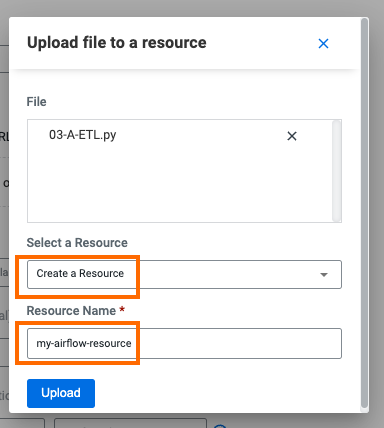
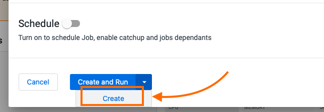
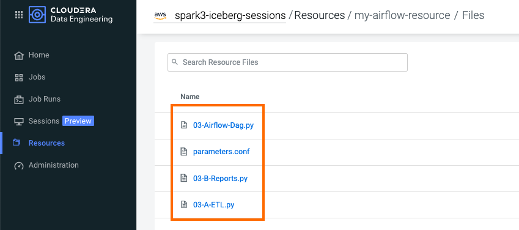
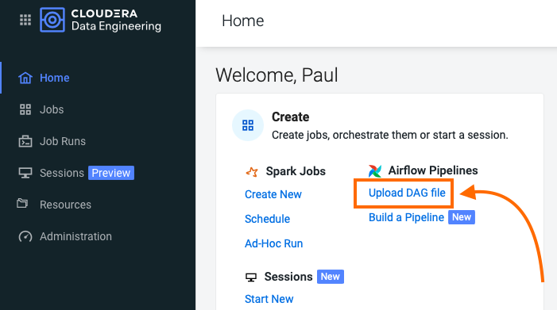
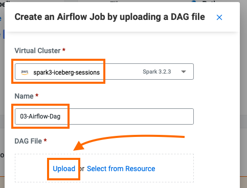
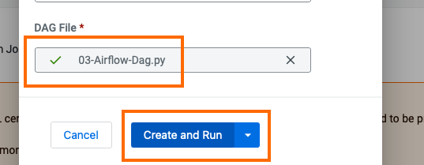
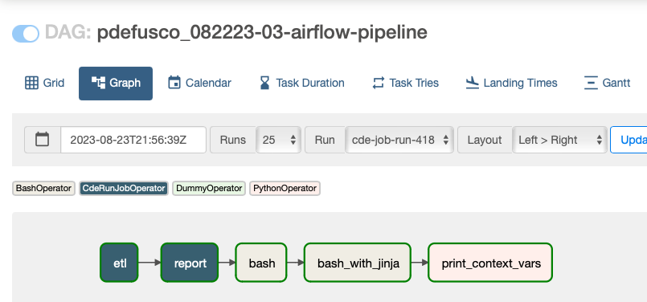

# Part 3: Orchestrating Data Engineering Pipelines with Airflow

## Objective

CDE Provides a Native Airflow Service that allows you to orchestrate complex CDE pipelines. Although primarily designed to orchestrate CDE Spark Jobs, CDE Airflow allows you to run queries in CDW and integrate with 3rd party Orchestration and DevOps tools.

This tutorial is divided in two sections. First you will build three Airflow jobs to schedule, orchestrate and monitor the execution of Spark Jobs and more. Then you will build an Airflow DAG with the Cloudera Airflow Editor, a No-Code tool that allows you to create Airflow DAGs in a simplified manner.

### Airflow Concepts

In Airflow, a DAG (Directed Acyclic Graph) is defined in a Python script that represents the DAGs structure (tasks and their dependencies) as code.

For example, for a simple DAG consisting of three tasks: A, B, and C. The DAG can specify that A has to run successfully before B can run, but C can run anytime. Also that task A times out after 5 minutes, and B can be restarted up to 5 times in case it fails. The DAG might also specify that the workflow runs every night at 10pm, but should not start until a certain date.

For more information about Airflow DAGs, see Apache Airflow documentation [here](https://airflow.apache.org/docs/apache-airflow/stable/concepts/dags.html). For an example DAG in CDE, see CDE Airflow DAG documentation [here](https://docs.cloudera.com/data-engineering/cloud/orchestrate-workflows/topics/cde-airflow-editor.html).

The Airflow UI makes it easy to monitor and troubleshoot your data pipelines. For a complete overview of the Airflow UI, see  Apache Airflow UI documentation [here](https://airflow.apache.org/docs/apache-airflow/stable/ui.html).

#### The Airflow UI

The Airflow UI makes it easy to monitor and troubleshoot your data pipelines. For a complete overview of the Airflow UI reference the [Apache Airflow documentation](https://airflow.apache.org/docs/apache-airflow/stable/ui.html).

#### What is an Airflow CDE Job?

CDE Jobs can be of two types: Spark and Airflow. Airflow CDE Jobs are typically used to orchestrate Spark CDE Jobs as well as other Data Engineering actions.

CDE Jobs of type Airflow consist primarily of an Airflow DAGs contained in a Python file. More on DAGs below.

There are three ways to build an Airflow CDE Job:

* Using the CDE Web interface. For more information, see [Running Jobs in Cloudera Data Engineering](https://docs.cloudera.com/data-engineering/cloud/manage-jobs/topics/cde-run-job.html).
* Using the CDE CLI tool. For more information, see Using the [Cloudera Data Engineering command line interface](https://docs.cloudera.com/data-engineering/cloud/cli-access/topics/cde-cli.html).
* Using CDE Rest API endpoints. For more information, see [CDE API Jobs](https://docs.cloudera.com/data-engineering/cloud/jobs-rest-api-reference/index.html)

In addition, you can automate migrations from Oozie on CDP Public Cloud Data Hub, CDP Private Cloud Base, CDH and HDP to Spark and Airflow CDE Jobs with the [oozie2cde API](https://github.com/pdefusco/Oozie2CDE_Migration).


## Deploying Orchestration Pipeline with Airflow

#### Review Airflow Basic DAG Code

Open "03-Airflow-Dag.py" from the "cde_airflow_jobs" folder, familiarize yourself with the code, and notice the following:

* Airflow allows you to break up complex Spark Pipelines in different steps, isolating issues and optionally providing retry options. The CDEJobRunOperator, BashOperator and PythonOperator are imported at lines 44-46. These allow you to execute a CDE Spark Job, Bash, and Python Code respectively all within the same workflow.

```
from cloudera.cdp.airflow.operators.cde_operator import CDEJobRunOperator
from airflow.operators.bash import BashOperator
from airflow.operators.python_operator import PythonOperator
from airflow.operators.dummy_operator import DummyOperator
from airflow.operators.http_operator import SimpleHttpOperator
```

* Each code block at lines 74, 80, 86, 92 and 102 instantiates an Operator. Each of them is stored as a variable named Step 1 through 5.

```
step1 = CDEJobRunOperator(
  task_id='etl',
  dag=intro_dag,
  job_name=cde_job_name_03_A #job_name needs to match the name assigned to the Spark CDE Job in the CDE UI
)

step2 = CDEJobRunOperator(
    task_id='report',
    dag=intro_dag,
    job_name=cde_job_name_03_B #job_name needs to match the name assigned to the Spark CDE Job in the CDE UI
)

step3 = BashOperator(
        task_id='bash',
        dag=intro_dag,
        bash_command='echo "Hello Airflow" '
        )

step4 = BashOperator(
    task_id='bash_with_jinja',
    dag=intro_dag,
    bash_command='echo "yesterday={{ yesterday_ds }} | today={{ ds }}| tomorrow={{ tomorrow_ds }}"',
)

#Custom Python Method
def _print_context(**context):
    print(context)

step5 = PythonOperator(
    task_id="print_context_vars",
    python_callable=_print_context,
    dag=intro_dag
)
```

* Step 2 and 3 are CDEJobRunOperator instances and are used to execute CDE Spark Jobs. At lines 89 and 95 the CDE Spark Job names have to be declared as they appear in the CDE Jobs UI. In this case, the fields are referencing the values assigned at lines 55 and 56.

<pre>

<b>cde_job_name_03_A = "job3A"
cde_job_name_03_B = "job3B"</b>

#Using the CDEJobRunOperator
step1 = CDEJobRunOperator(
  task_id='etl',
  dag=intro_dag,
  <b>job_name=cde_job_name_03_A</b>
)

step2 = CDEJobRunOperator(
    task_id='report',
    dag=intro_dag,
    <b>job_name=cde_job_name_03_B</b>
)
</pre>

* Finally, task dependencies are specified at line 119. Steps 1 - 5 are executed in sequence, one when the other completes. If any of them fails, the remaining CDE Jobs will not be triggered.

```
step1 >> step2 >> step3 >> step4 >> step5
```

#### Deploy Airflow Basic DAG Code

Create two CDE Spark Jobs (in the UI or with the CLI) using scripts "04-A-ETL.py" and "04-B-Reports.py" but *do not run them yet*.

Upload the scripts from your local machine and create a new File Resource. Make sure to name it after yourself so it doesn't collide with other workshop participants.






Then, open "03-Airflow-Dag.py" and enter the names of the two CDE Spark Jobs as they appear in the CDE Jobs UI at lines 55 and 56.

In addition, notice that credentials stored in parameters.conf are not available to CDE Airflow jobs. Therefore, update the "username" variable at line 51 with something unique.

The "username" variable is read at line 67 to create a dag_name variable which in turn will be used at line 70 to assign a unique DAG name when instantiating the DAG object.

>**⚠ Warning**  
>CDE requires a unique DAG name for each CDE Airflow Job or will otherwise return an error upon job creation.

Finally, modify lines 63 and 64 to assign a start and end date that takes place in the future.

>**⚠ Warning**   
> If you don't edit the start and end date, the CDE Airflow Job might fail. The Start Date parameter must reflect a date in the past while the End Date must be in the future. If you are getting two identical Airflow Job runs you have set both dates in the past.  

Upload the updated script to your CDE Files Resource along with the parameters.conf file. The new File Resource should now have four files in total.



Then navigate back to the CDE Home Page and create a new CDE Job of type Airflow.



As before, select your Virtual Cluster and Job name. Then create and execute.



Create a new CDE File Resource for this or reuse your existing resource if you have one from a previous step.




Navigate to the Job Runs tab and notice that the Airflow DAG is running. While in progress, navigate back to the CDE Home Page, scroll down to the Virtual Clusters section and open the Virtual Cluster Details. Then, open the Airflow UI.


Familiarize yourself with the Airflow UI. Then, open the Dag Runs page and validate the CDE Airflow Job's execution.




To learn more about CDE Airflow please visit [Orchestrating Workflows and Pipelines](https://docs.cloudera.com/data-engineering/cloud/orchestrate-workflows/topics/cde-airflow-editor.html) in the CDE Documentation.


## Deploying Orchestration Pipeline with Cloudera Airflow Editor

You can use the CDE Airflow Editor to build DAGs without writing code. This is a great option if your DAG consists of a long sequence of CDE Spark or CDW Hive jobs.

From the CDE Jobs UI, create a new CDE Job of type Airflow as shown below. Ensure to select the "Editor" option. Then click create.


From the Editor Canvas drag and drop the Shell Script action. This is equivalent to instantiating the BashOperator. Click on the icon on the canvas and an option window will appear on the right side. Enter the "dag start" in the Bash Command section.


From the Canvas, drop two CDE Job Actions. Configure them with Job Name "sql_job". You already created this CDE Spark Job in part 2.


Next, drag and drop a Python action. In the code section, add *print("DAG Terminated")* as shown below.


Finally, complete the DAG by connecting each action.


For each of the two CDE Jobs, open the action by clicking on the icon on the canvas. Select "Depends on Past" and then "all_success" in the "Trigger Rule" section.


Execute the DAG and observe it from the CDE Job Runs UI.


## Summary

Apache Airflow is a platform to author, schedule and execute Data Engineering pipelines. It is widely used by the community to create dynamic and robust workflows for batch Data Engineering use cases.

CDE embeds Apache Airflow at the CDE Virtual Cluster level. It is automatically deployed for the CDE user during CDE Virtual Cluster creation and requires no maintenance on the part of the CDE Admin.

A CDE Airflow Job allows you to deploy an Airflow DAG as a CDE Job. The primary use case is the orchestration of CDE Spark Jobs. The Cloudera Airflow Editor simplifies DAG code by providing a no-code / low-code interface for building DAGs. If you primarily use CDE to productionize many CDE Spark Jobs the Airflow Editor can be a great choice. The Airflow DAG instead leveeages Python to construct DAG logic. It is a bery good option if you use Airflow open source operators or need to apply complex business logic to your workflow.

If you would like to experiment with a more advanced Airflow use case in CDE please visit [Bonus Lab 1](https://github.com/pdefusco/CDE119_ACE_WORKSHOP/blob/main/step_by_step_guides/english/part05_bonus_labs.md#bonus-lab-1-cde-airflow-orchestration-in-depth).

[In the next section](https://github.com/pdefusco/CDE119_ACE_WORKSHOP/blob/main/step_by_step_guides/english/part04_spark_migration_tool.md#part-4-using-the-cde-spark-migration-tool-to-convert-spark-submits-to-cde-spark-submits) you will experiment with the CDE Spark Migration Tool to convert Spark-Submits into CDE Spark-Submits programmatically.
