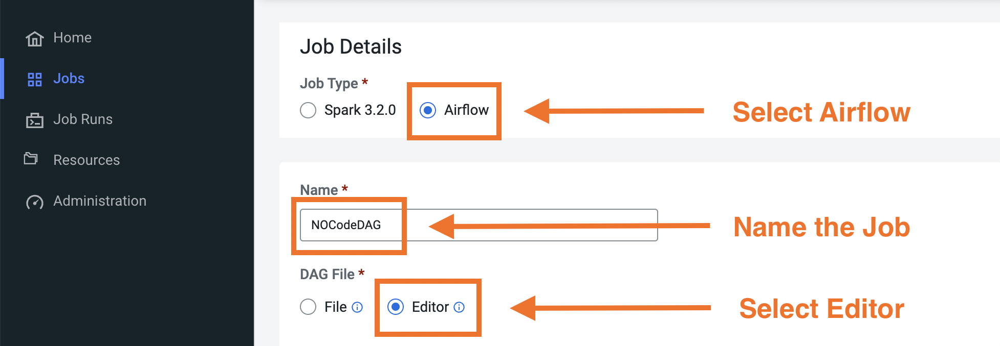
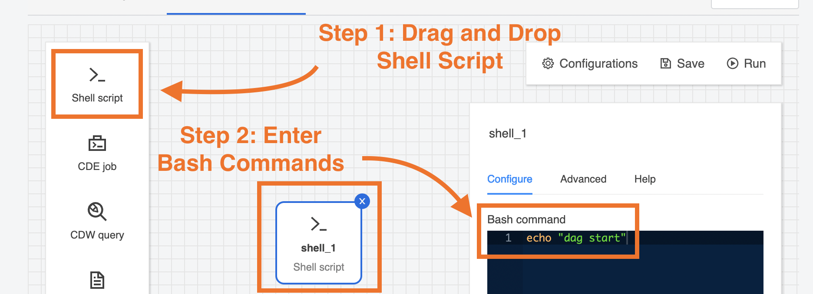
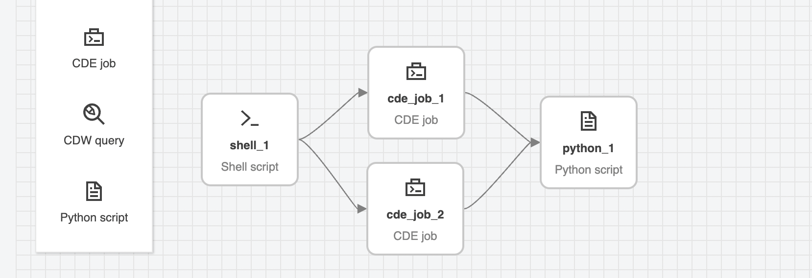

# Part 3: Orchestrating Pipelines with Airflow

### Summary

CDE Provides a Native Airflow Service that allows you to orchestrate complex CDE pipelines. Although primarily designed to orchestrate CDE Spark Jobs, CDE Airflow allows you to run queries in CDW and integrate with 3rd party Orchestration and DevOps tools.

This tutorial is divided in two sections. First you will build three Airflow jobs to schedule, orchestrate and monitor the execution of Spark Jobs and more. Then you will build an Airflow DAG with the Cloudera Airflow Editor, a No-Code tool that allows you to create Airflow DAGs in a simplified manner.

#### Airflow Concepts

In Airflow, a DAG (Directed Acyclic Graph) is defined in a Python script that represents the DAGs structure (tasks and their dependencies) as code.

For example, for a simple DAG consisting of three tasks: A, B, and C. The DAG can specify that A has to run successfully before B can run, but C can run anytime. Also that task A times out after 5 minutes, and B can be restarted up to 5 times in case it fails. The DAG might also specify that the workflow runs every night at 10pm, but should not start until a certain date.

For more information about Airflow DAGs, see Apache Airflow documentation [here](https://airflow.apache.org/docs/apache-airflow/stable/concepts/dags.html). For an example DAG in CDE, see CDE Airflow DAG documentation [here](https://docs.cloudera.com/data-engineering/cloud/orchestrate-workflows/topics/cde-airflow-editor.html).

The Airflow UI makes it easy to monitor and troubleshoot your data pipelines. For a complete overview of the Airflow UI, see  Apache Airflow UI documentation [here](https://airflow.apache.org/docs/apache-airflow/stable/ui.html).

##### Executing Airflow Basic DAG

Open "05-Airflow-Basic-DAG.py", familiarize yourself with the code, and notice the following:

* Airflow allows you to break up complex Spark Pipelines in different steps, isolating issues and optionally providing retry options. The CDEJobRunOperator, BashOperator and PythonOperator are imported at lines 44-46. These allow you to execute a CDE Spark Job, Bash, and Python Code respectively all within the same workflow.

```
from cloudera.cdp.airflow.operators.cde_operator import CDEJobRunOperator
from airflow.operators.bash import BashOperator
from airflow.operators.python_operator import PythonOperator
from airflow.operators.dummy_operator import DummyOperator
from airflow.operators.http_operator import SimpleHttpOperator
```

* Each code block at lines 74, 80, 86, 92 and 102 instantiates an Operator. Each of them is stored as a variable named Step 1 through 5.

```
step1 = CDEJobRunOperator(
  task_id='etl',
  dag=intro_dag,
  job_name=cde_job_name_03_A #job_name needs to match the name assigned to the Spark CDE Job in the CDE UI
)

step2 = CDEJobRunOperator(
    task_id='report',
    dag=intro_dag,
    job_name=cde_job_name_03_B #job_name needs to match the name assigned to the Spark CDE Job in the CDE UI
)

step3 = BashOperator(
        task_id='bash',
        dag=intro_dag,
        bash_command='echo "Hello Airflow" '
        )

step4 = BashOperator(
    task_id='bash_with_jinja',
    dag=intro_dag,
    bash_command='echo "yesterday={{ yesterday_ds }} | today={{ ds }}| tomorrow={{ tomorrow_ds }}"',
)

#Custom Python Method
def _print_context(**context):
    print(context)

step5 = PythonOperator(
    task_id="print_context_vars",
    python_callable=_print_context,
    dag=intro_dag
)
```

* Step 2 and 3 are CDEJobRunOperator instances and are used to execute CDE Spark Jobs. At lines 89 and 95 the CDE Spark Job names have to be declared as they appear in the CDE Jobs UI. In this case, the fields are referencing two variables at lines 52 and 53.

```
#Using the CDEJobRunOperator
step1 = CDEJobRunOperator(
  task_id='etl',
  dag=intro_dag,
  **job_name=cde_job_name_03_A #job_name needs to match the name assigned to the Spark CDE* Job in the CDE UI**
)

step2 = CDEJobRunOperator(
    task_id='report',
    dag=intro_dag,
    **job_name=cde_job_name_03_B #job_name needs to match the name assigned to the Spark CDE Job in the CDE UI**
)
```

* Finally, task dependencies are specified at line 109. Steps 1 - 5 are executed in sequence, one when the other completes. If any of them fails, the remaining CDE Jobs will not be triggered.

Create two CDE Spark Jobs using scripts "05-A-ETL.py" and "05-B-Reports.py" but do not run them.

Then, open "05-Airflow-Basic-DAG.py" and enter the names of the two CDE Spark Jobs as they appear in the CDE Jobs UI at lines 52 and 53.

In addition, notice that credentials stored in parameters.conf are not available to CDE Airflow jobs. Therefore, update the "username" variable at line 48 in "05-Airflow-Basic-DAG.py".

The "username" variable is read at line 64 to create a dag_name variable which in turn will be used at line 67 to assign a unique DAG name when instantiating the DAG object.

Finally, modify lines 60 and 61 to assign a start and end date that takes place in the future.

>**⚠ Warning**  
>CDE requires a unique DAG name for each CDE Airflow Job or will otherwise return an error upon job creation.

>**⚠ Warning**   
> If you don't edit the start and end date, the CDE Airflow Job might fail. The Start Date parameter must reflect a date in the past while the End Date must be in the future. If you are getting two identical Airflow Job runs you have set both dates in the past.  

Upload the updated script to your CDE Files Resource. Then navigate back to the CDE Home Page and create a new CDE Job of type Airflow.


As before, select your Virtual Cluster and Job name. Then create and execute.


Navigate to the Job Runs tab and notice that the Airflow DAG is running. While in progress, navigate back to the CDE Home Page, scroll down to the Virtual Clusters section and open the Virtual Cluster Details. Then, open the Airflow UI.


Familiarize yourself with the Airflow UI. Then, open the Dag Runs page and validate the CDE Airflow Job's execution.


To learn more about CDE Airflow please visit [Orchestrating Workflows and Pipelines](https://docs.cloudera.com/data-engineering/cloud/orchestrate-workflows/topics/cde-airflow-editor.html) in the CDE Documentation.

##### Using the No-Code CDE Airflow Editor to Build Airflow DAGs in the UI

You can use the CDE Airflow Editor to build DAGs without writing code. This is a great option if your DAG consists of a long sequence of CDE Spark or CDW Hive jobs.

From the CDE Jobs UI, create a new CDE Job of type Airflow as shown below. Ensure to select the "Editor" option. Then click create.



From the Editor Canvas drag and drop the Shell Script action. This is equivalent to instantiating the BashOperator. Click on the icon on the canvas and an option window will appear on the right side. Enter the "dag start" in the Bash Command section.



From the Canvas, drop two CDE Job Actions. Configure them with Job Name "sql_job". You already created this CDE Spark Job in part 2.


Next, drag and drop a Python action. In the code section, add *print("DAG Terminated")* as shown below.


Finally, complete the DAG by connecting each action.



For each of the two CDE Jobs, open the action by clicking on the icon on the canvas. Select "Depends on Past" and then "all_success" in the "Trigger Rule" section.


Execute the DAG and observe it from the CDE Job Runs UI.


