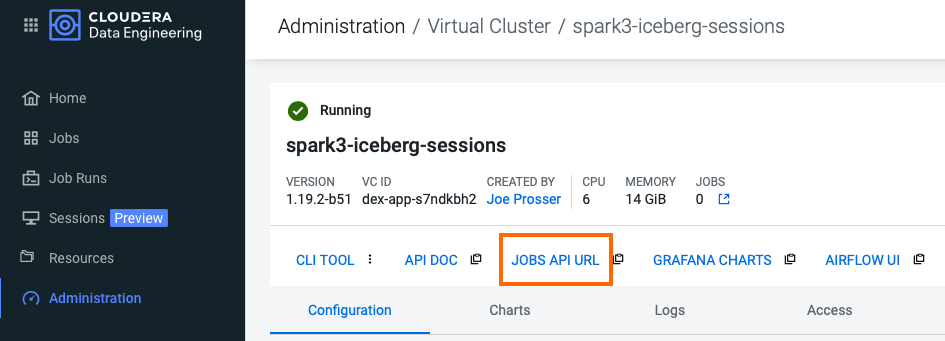

# Part 4: Using the CDE Spark Migration Tool to Convert Spark Submits to CDE Spark Submits

### Summary

The spark-submit command is a utility to run or submit a Spark or PySpark application program (or job) to the cluster by specifying options and configurations, the application you are submitting can be written in Scala, Java, or Python (PySpark).

The CDE CLI provides a similar although not identical way of running "spark-submits" in CDE. However, adapting many spark-submita to CDE might become an obstacle in your migration. The Cloudera Engineering team created a Spark Migration tool to facilitate the conversion.

#### Step By Step Instructions

>**⚠ Warning**  
>The Spark Submit Migration tool requires having the CDE CLI installed on your machine. Please ensure you have completed the installation steps in Part 3.

>**⚠ Warning**  
>This tutorial utilizes Docker to streamline the installation process of the Spark Submit Migration tool. If you don't have Docker installed on your machine you will have to go through [this tutorial by Vish Rajagopalan](https://github.com/SuperEllipse/cde-spark-submit-migration) instead.

Navigate to the CDP Management Console and download your user credentials file. The credentials file includes a CDP Access Key ID and a CDP Private Key.


Next, navigate to the CDE Virtual Cluster Details and copy the JOBS_API_URL.



Launch the example Docker container.

```
docker run -it pauldefusco/cde_spark_submit_migration_tool:latest
```

You are now inside the running container. Next, activate the Spark Submit Migration tool by running the following shell command.

```
cde-env.sh activate -p vc-1
```

Navigate to the .cde folder and place the CDP Access Key ID and Private Key you downloaded earlier in the respective fields in the credentials file.

Next, open the config.yaml file located in the same folder. Replace the cdp console value at line 3 with the CDP Console URL (e.g. `https://console.us-west-1.cdp.cloudera.com/`).
Then, enter your JOBS_API_URL in the "vcluster-endpoint" field at line 8.

Finally, run the following spark-submit. This is a sample submit taken from a legacy CDH cluster.

```
spark-submit \
--master yarn \
--deploy-mode cluster \
--num-executors 2 \
--executor-cores 1 \
--executor-memory 2G \
--driver-memory 1G \
--driver-cores 1 \
--queue default \
06-pyspark-sql.py
```

Shortly you should get output in your terminal including a Job Run ID confirming successful job submission to CDE. In the screenshot example below the Job Run ID is 9.


Navigate to your CDE Virtual Cluster Job Runs page and validate the job is running or has run successfully.


>**⚠ Warning**  
>If you are unable to run the spark-submit you may have to remove the tls setting from config.yaml. In other words, completely erase line 4.
