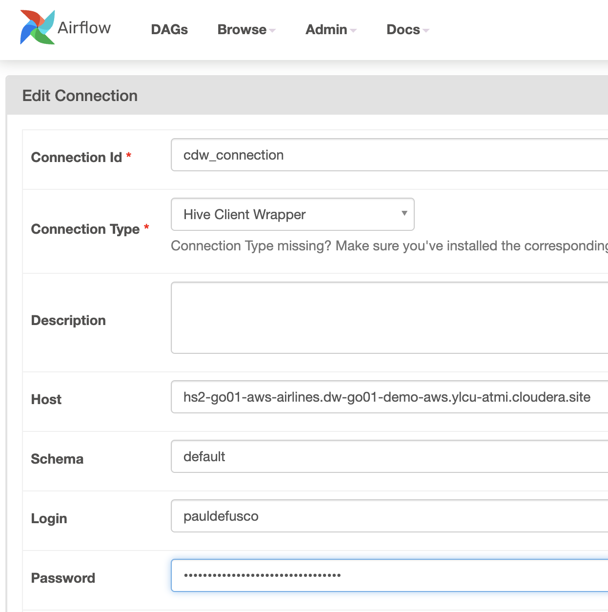
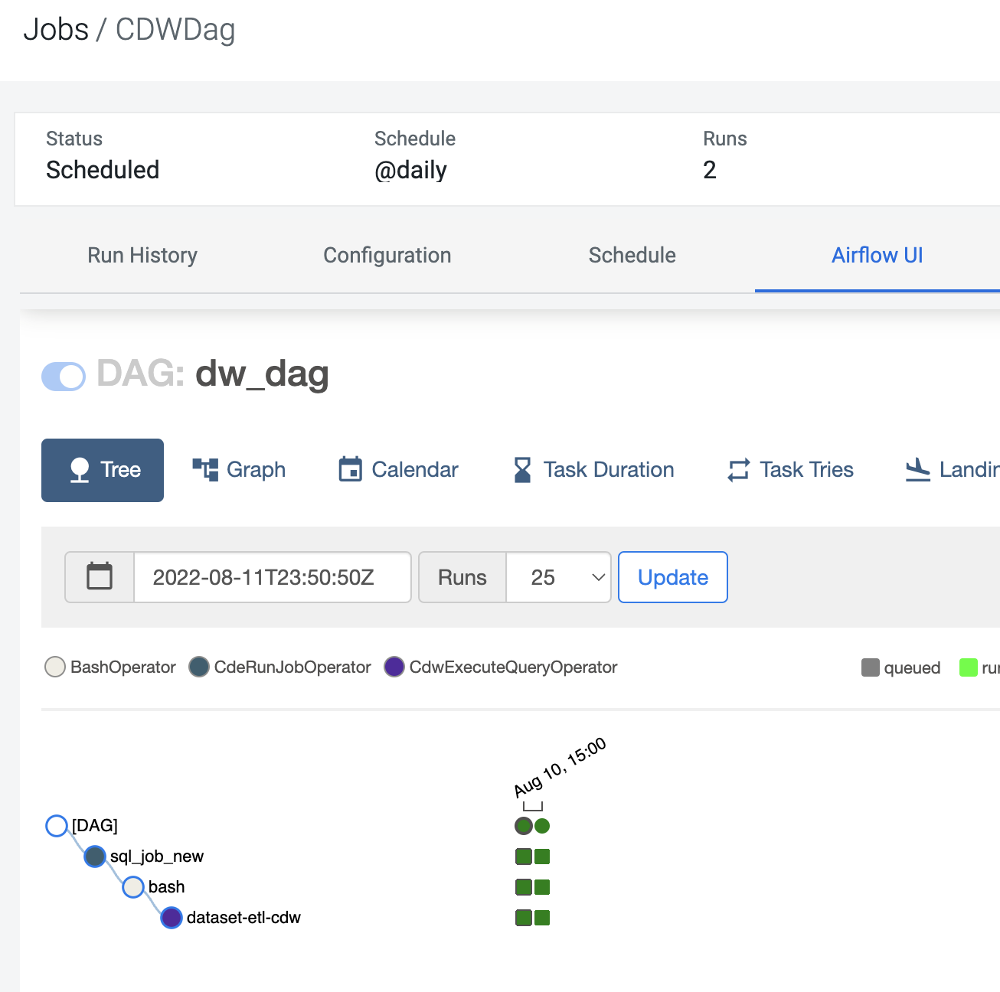
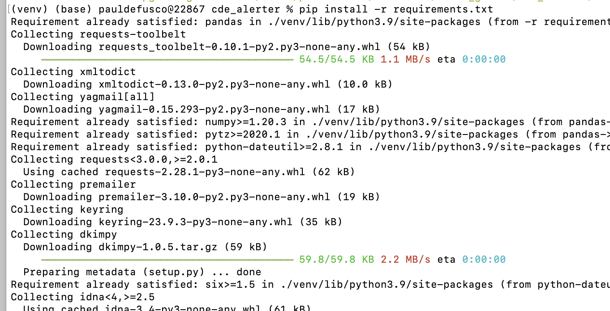

# Part 5: Bonus Labs

## Objective

So far you explored the core aspects of Spark, Airflow and Iceberg in CDE. The following labs give you an opportunity to explore CDE in more detail.

Each Bonus Lab can be run independently of another. In other words, you can run all or just a select few, and in any order that you prefer.

### Bonus Lab 1: CDE Airflow Orchestration (In-Depth)

Part 2 of the lab introduced you to a basic Airflow DAG in CDE. However, Airflow's capabilities include a wide variety of operators, the ability to store temporary context values, connecting to 3rd party systems and overall the ability to implement more advanced orchestration use cases.

Using "bonus-01_Airflow_Operators.py" you will create a new CDE Airflow Job with other popular Operators such as the SimpleHttpOperator Operator to send/receive API requests.

First you must set up a Connection to the API endpoint you will reference in the DAG code. Navigate back to the CDE Administration tab, open your Virtual Cluster's "Cluster Details" and then click on the "Airflow" icon to reach the Airflow UI.


Open Airflow Connections under the Admin dropdown as shown below.


Airflow Connections allow you to predefine connection configurations so that they can be referenced within a DAG for various purposes. In our case, we will create a new connection to access the "Random Joke API" and in particular the "Programming" endpoint.


Fill out the following fields as shown below and save.

```
Connection Id: random_joke_connection
Connection Type: HTTP
Host: https://official-joke-api.appspot.com/
```


Now open "bonus-01_Airflow_Operators.py" and familiarize yourself with the code. Some of the most notable aspects of this DAG include:

* Review line 170. Task Execution no longer follows a linear sequence. Step 5 triggers step 6a and 6b. Step 6c only executes when both Step 6a and 6b have completed successfully.

```
step1 >> step2 >> step3 >> step4 >> step5 >> [step6a, step6b] >> step6c >> step7 >> step8
```

* At lines 80-83, the DummyOperator Operator is used as a placeholder and starting place for Task Execution.

```
start = DummyOperator(
    task_id="start",
    dag=operators_dag
)
```

* At lines 147-156, the SimpleHttpOperator Operator is used to send a request to an API endpoint. This provides an optional integration point between CDE Airflow and 3rd Party systems or other Airflow services as requests and responses can be processed by the DAG.

* At line 150 the connection id value is the same as the one used in the Airflow Connection you just created. At line 151 the endpoint value determines the API endpoint your requests will hit. This is appended to the base URL you set in the Airflow Connection.

* At line 153 the response is captured and parsed by the "handle_response" method specified between lines 139-145.

* At line 155 the "do_xcom_push" option is used to write the response as a DAG context variable. Now the response is temporarily stored for the duration of the Airflow Job and can be reused by other operators.

<pre>
step7 = SimpleHttpOperator(
    task_id="random_joke_api",
    method="GET",
    <b>http_conn_id="random_joke_connection"<b\>,
    <b>endpoint="/jokes/programming/random"<b\>,
    headers={"Content-Type":"application/json"},
    <b>response_check=lambda response: handle_response(response)<b\>,
    dag=operators_dag,
    <b>do_xcom_push=True<b\>
)
<pre\>

* At lines 161-165 the Python Operator executes the "_print_random_joke" method declared at lines 158-159 and outputs the response of the API call.

```
def _print_random_joke(**context):
    return context['ti'].xcom_pull(task_ids='random_joke_api')

step8 = PythonOperator(
    task_id="print_random_joke",
    python_callable=_print_random_joke,
    dag=operators_dag
)
```

As in the part 3, first create *(but don't run)* three CDE Spark Jobs using "05_C_pyspark_LEFT.py", "05_D_pyspark_RIGHT.py" and  "05_E_pyspark_JOIN.py".

Then, open "bonus-01_Airflow_Operators.py" in your editor and update your username at line 51. Make sure that the job names at lines 55-59 reflect the three CDE Spark Job names as you entered them in the CDE Job UI.

Finally, upload the script to your CDE Files Resource. Create a new CDE Job of type Airflow, select the script from your CDE Resource and run it.

>**Note**
>The SimpleHttpOperator Operator can be used to interact with 3rd party systems and exchange data to and from a CDE Airflow Job run. For example you could trigger the execution of jobs outside CDP or execute CDE Airflow DAG logic based on inputs from 3rd party systems.

>**Note**  
>You can use CDE Airflow to orchestrate SQL queries in CDW, the Cloudera Data Warehouse Data Service, with the Cloudera-supported  CDWOperator. If you want to learn more, please go to [Bonus Lab 1: Using CDE Airflow with CDW](https://github.com/pdefusco/CDE_Tour_ACE_HOL/blob/main/step_by_step_guides/english.md#bonus-lab-1-using-cde-airflow-with-cdw).

>**Note**  
>Additionally, other operators including Python, HTTP, and Bash are available in CDE. If you want to learn more about Airflow in CDE, please reference [Using CDE Airflow](https://github.com/pdefusco/Using_CDE_Airflow).


### Bonus Lab 2: Using CDE Airflow with CDW

You can use the CDWRunOperator to run CDW queries from a CDE Airflow DAG. This operator has been created and is fully supported by Cloudera.

##### CDW Setup Steps

Before we can use the operator in a DAG you need to establish a connection between CDE Airflow to CDW. To complete these steps, you must have access to a CDW virtual warehouse.

CDE currently supports CDW operations for ETL workloads in Apache Hive virtual warehouses. To determine the CDW hostname to use for the connection:

Navigate to the Cloudera Data Warehouse Overview page by clicking the Data Warehouse tile in the Cloudera Data Platform (CDP) management console.


In the Virtual Warehouses column, find the warehouse you want to connect to.


Click the three-dot menu for the selected warehouse, and then click Copy JDBC URL.


Paste the URL into a text editor, and make note of the hostname. For example, starting with the following url the hostname would be:

```
Original URL: jdbc:hive2://hs2-aws-2-hive.env-k5ip0r.dw.ylcu-atmi.cloudera.site/default;transportMode=http;httpPath=cliservice;ssl=true;retries=3;

Hostname: hs2-aws-2-hive.env-k5ip0r.dw.ylcu-atmi.cloudera.site
```

##### CDE Setup Steps

Navigate to the Cloudera Data Engineering Overview page by clicking the Data Engineering tile in the Cloudera Data Platform (CDP) management console.

In the CDE Services column, select the service containing the virtual cluster you are using, and then in the Virtual Clusters column, click  Cluster Details for the virtual cluster. Click AIRFLOW UI.


From the Airflow UI, click the Connection link from the Admin tab.


Click the plus sign to add a new record, and then fill in the fields:

* Conn Id: Create a unique connection identifier, such as "cdw_connection".
* Conn Type: Select Hive Client Wrapper.
* Host: Enter the hostname from the JDBC connection URL. Do not enter the full JDBC URL.
* Schema: default
* Login: Enter your workload username and password.

Click Save.



##### Editing the DAG Python file

Now you are ready to use the CDWOperator in your Airflow DAG. Open the "bonus-01_Airflow_CDW.py" script and familiarize yourself with the code.

The Operator class is imported at line 47.

```
from cloudera.cdp.airflow.operators.cdw_operator import CDWOperator
```

An instance of the CDWOperator class is created at lines 78-86.

```
cdw_query = """
show databases;
"""

dw_step3 = CDWOperator(
    task_id='dataset-etl-cdw',
    dag=example_dag,
    cli_conn_id='cdw_connection',
    hql=cdw_query,
    schema='default',
    use_proxy_user=False,
    query_isolation=True
)
```

Notice that the SQL syntax run in the CDW Virtual Warehouse is declared as a separate variable and then passed to the Operator instance as an argument. The Connection is also passed as an argument at line

Finally, notice that task dependencies include both the spark and dw steps:

```
spark_step >> dw_step
```

Next, create a new Airflow CDE Job named "CDW Dag". Upload the new DAG file to the same or a new CDE resource as part of the creation process.


Navigate to the CDE Job Runs Page and open the run's Airflow UI. Then open the Tree View and validate that the job has succeeded.




### Bonus Lab 3: Using the CDE CLI to Streamline CDE Production Use Cases (In-Depth)

#### Summary

The majority of CDE Production use cases rely on the CDE API and CLI. With them, you can easily interact with CDE from a local IDE and build integrations with external 3rd party systems. For example, you can implement multi-CDE cluster workflows with GitLabCI or Python.  

In this part of the workshop you will gain familiarity with the CDE CLI by rerunning the same jobs and interacting with the service remotely.

You can use the CDE CLI or API to execute Spark and Airflow jobs remotely rather than via the CDE UI as shown up to this point. In general, the CDE CLI is recommended over the UI when running spark submits from a local machine. The API is instead recommended when integrating CDE Spark Jobs or Airflow Jobs (or both) with 3rd party orchestration systems. For example you can use GitLab CI to build CDE Pipelines across multiple Virtual Clusters. For a detailed example, please reference [GitLab2CDE](https://github.com/pdefusco/Gitlab2CDE).

We assume you have already installed the CLI following the instructions in Part 1. If you haven't done so, please install the CDE CLI now.

First, create a Python virtual environment and install the requirements.


#### Using the CDE CLI

###### Run Spark Job:

This command will run the script as a simple Spark Submit. This is slightly different from creating a CDE Job of type Spark as the Job definition will not become reusable.

>**⚠ Warning**  
> The CLI commands below are meant to be copy/pasted in your terminal as-is and run from the "cde_tour_ace_hol" directory. However, you may have to update the script path in each command if you're running these from a different folder.

```
cde spark submit --conf "spark.pyspark.python=python3" cde_cli_jobs/01_pyspark-sql.py
```

###### Check Job Status:

This command will allow you to obtain information related to the above spark job. Make sure to replace the id flag with the id provided when you executed the last script e.g. 199.

```
cde run describe --id 199
```

###### Review the Output:

This command shows the logs for the above job. Make sure to replace the id flag with the id provided when you executed the last script.  

```
cde run logs --type "driver/stdout" --id 199
```

###### Create a CDE Resource:

This command creates a CDE Resource of type File:

```
cde resource create --name "my_CDE_Resource"
```

###### Upload file(s) to resource:

This command uploads the "01_pyspark-sql.py" script into the CDE Resource.

```
cde resource upload --local-path "cde_cli_jobs/01_pyspark-sql.py" --name "my_CDE_Resource"
```

###### Validate CDE Resource:

This command obtains information related to the CDE Resource.

```
cde resource describe --name "my_CDE_Resource"
```

###### Schedule CDE Spark Job with the File Uploaded to the CDE Resource

This command creates a CDE Spark Job using the file uploaded to the CDE Resource.

```
cde job create --name "PySparkJob_from_CLI" --type spark --conf "spark.pyspark.python=python3" --application-file "/app/mount/01_pyspark-sql.py" --cron-expression "0 */1 * * *" --schedule-enabled "true" --schedule-start "2022-11-28" --schedule-end "2023-08-18" --mount-1-resource "my_CDE_Resource"
```

###### Validate Job:

This command obtains information about CDE Jobs whose name contains the string "PySparkJob".

```
cde job list --filter 'name[like]%PySparkJob%'
```

###### Learning to use the CDE CLI

The CDE CLI offers many more commands. To become familiarized with it you can use the "help" command and learn as you go. Here are some examples:

```
cde --help
cde job --help
cde run --help
cde resource --help
```

To learn more about the CDE CLI please visit [Using the Cloudera Data Engineering command line interface](https://docs.cloudera.com/data-engineering/cloud/cli-access/topics/cde-cli.html) in the CDE Documentation.


### Bonus Lab 4: Using Python with the CDE API

Cloudera Data Engineering (CDE) provides a robust API for integration with your existing continuous integration/continuous delivery platforms. In this example we will use Python to create and deploy Spark Jobs in CDE from your local machine. The same code can execute on other platforms and 3rd party tools.

##### Introduction to the CDE API

The Cloudera Data Engineering service API is documented in Swagger. You can view the API documentation and try out individual API calls by accessing the API DOC link in any virtual cluster:

In the Data Engineering web console, select an environment.
Click the Cluster Details icon in any of the listed virtual clusters.
Click the link under API DOC.

##### Basic API Workflow

Obtain CDE Token and Set Environment Variable:

```
export CDE_TOKEN=$(curl -u <workload_user> $(echo '<grafana_charts>' | cut -d'/' -f1-3 | awk '{print $1"/gateway/authtkn/knoxtoken/api/v1/token"}') | jq -r '.access_token')
```

Create a sample CDE Resource

```
curl -H "Authorization: Bearer $ACCESS_TOKEN" -X POST \
  "$JOBS_API_URL/resources" -H "Content-Type: application/json" \
  -d "{ \"name\": \"cml2cde_api_resource\"}"
```

Validate CDE Resource Creation

```
curl -H "Authorization: Bearer $ACCESS_TOKEN" -X GET "$JOBS_API_URL/resources/cml2cde_api_resource"
```

Upload Spark Job Script

```
curl -H "Authorization: Bearer $ACCESS_TOKEN" -X PUT \
  "$JOBS_API_URL/resources/cml2cde_api_resource/Data_Extraction_Sub_150k.py" \
  -F "file=@/home/cdsw/cml2cde_tutorial_code/Data_Extraction_Sub_150k.py"
```

Create CDE Spark Job

```
curl -H "Authorization: Bearer $ACCESS_TOKEN" -X POST "$JOBS_API_URL/jobs" \
          -H "accept: application/json" \
          -H "Content-Type: application/json" \
          -d "{ \"name\": \"cml2cde_api_job\", \"type\": \"spark\", \"retentionPolicy\": \"keep_indefinitely\", \"mounts
```

Run CDE Spark Job

```
curl -H "Authorization: Bearer $ACCESS_TOKEN" -X POST "$JOBS_API_URL/jobs/cml2cde_api_job/run"
```

##### Using Python

You can use the Python Requests library to wrap the above methods. For example you can build a function to download the CDE Token via:

```
import requests

def set_cde_token():
    rep = os.environ["JOBS_API_URL"].split("/")[2].split(".")[0]
    os.environ["GET_TOKEN_URL"] = os.environ["JOBS_API_URL"].replace(rep, "service").replace("dex/api/v1", "gateway/authtkn/knoxtoken/api/v1/token")
    token_json = !curl -u $WORKLOAD_USER:$WORKLOAD_PASSWORD $GET_TOKEN_URL
    os.environ["ACCESS_TOKEN"] = json.loads(token_json[5])["access_token"]
    return json.loads(token_json[5])["access_token"]
```

Once you set the JOBS_API_URL correctly you can run the following code to download the CDE Token:

```
JOBS_API_URL = "https://ewefwfw.cde-6fhtj4hthr.my-cluster.ylcu-atmi.cloudera.site/dex/api/v1"

tok = set_cde_token()
```

Although this can work in an interactive setting, we recommend using CDE Sessions as they allow you to directly use the PySpark and Spark Scala shells. In general, the API is a great choice for building applications. For example, you could use Python to issue a CDE API Request in order to monitor CDE Resources:

```
url = os.environ["JOBS_API_URL"] + "/resources"
myobj = {"name": "cml2cde_python"}
headers = {"Authorization": f'Bearer {tok}',
          "Content-Type": "application/json"}

x = requests.get(url, headers=headers)
x.json()["resources"][-3:-1]
```

As an exmaple we built [CDE Alerter](https://github.com/pdefusco/CDE_Alerter) and the cde_python module. CDE Alerter is a Python App to continuously monitor the status of CDE Jobs across multiple CDE Virtual Clusters. It allows you to flag CDE Jobs that last more than a provided number of seconds. It uses cde_python, a custom Python wrapper for the CDE API, to periodically submit requests to the CDE Virtual Cluster. The general idea is that you can use Python to implement a set of business rules in case of a particular event in a CDE Cluster.  

In order to run this App in your local machine little to none code changes are required. You will need Python 3.6 or above, a Gmail account with 2-step authentication and an App password. Steps to set up a Gmail account correctly are provided below. We do not recommend using your existing Gmail account if you have one and instead creating a new one as shown below.

## Instructions

#### Step 0: Project setup

Clone this GitHub repository to your local machine or the VM where you will be running the script.

```
mkdir ~/Documents/CDE_Alerter
cd ~/Documents/CDE_Alerter
git clone https://github.com/pdefusco/CDE_Alerter.git
```

Alternatively, if you don't have GitHub create a folder on your local computer; navigate to [this URL](https://github.com/pdefusco/CDE_Alerter.git) and download the files.


#### Step 1: Create a Python Virtual Environment and Install Requirements

Although a Python Virtual Environment is optional, it is highly recommended. To create one and install requirements execute the following commands:

```
#Create
python3 -m venv venv

#Activate
source venv/bin/activate

#Install single package
pip install pandas #Optionally use pip3 install

#Install requirements
pip install -r requirements.txt #Optionally use pip3 install
```




#### Step 2: Edit Clusters.txt and Test CDE Connection

The clusters.txt file contains a list of JOBS_API_URL and email addresses, reflecting the cluster(s) you want to monitor and the email addresses to be notified.

Add your JOBS_API_URL and email to clusters.txt and remove any other entries. The app works with one or multiple cluster entries. Then, ensure that your machine or VM can reach the CDE Virtual Cluster by running the following command in the terminal:

```
python3 connection_tester.py jobs_api_url cdpusername cdppwd
```

The output in the terminal should confirm that a test resource has been created successfully.


#### Step 3: Run the script

Before you can run the script you will need:
* The CDE JOBS API URL for the intended CDE Virtual Cluster you want to monitor.
* The Gmail APP password (not just the account login password). If you need help setting this up for the first time:
  1. Recommended: [Create a New Gmail Account](https://support.google.com/mail/answer/56256?hl=en)
  2. [Enable 2-step Authentication and Create an App Password](https://www.youtube.com/watch?v=hXiPshHn9Pw)
* The CDP User and Password you will authenticate into the CDE Virtual Cluster with.

To run the script, run the following python command in the directory where you cloned your project.

```
python3 alerter.py https://z4xgdztf.cde-6fr6l74r.go01-dem.ylcu-atmi.cloudera.site/dex/api/v1 cdpusername cdppwd mysecregapppwdhere 1800 me@myco.com mycolleague@myco.com
```

The Gmail App password should be entered as the fourth argument (for example replacing "mysecregapppwdhere" above).

The script will automatically detect whether more than 1800 seconds (30 minutes) have expired between the start and end time of any of your CDE Jobs.

If any CDE Jobs meet the criteria, the script will automatically send a notification to the provided emails. You can enter two email recipients by adding them as the last two arguments at script execution.

As an example, if we lower the time window from 1800 seconds to 18 seconds the script will detect some jobs and output the following to the terminal.


If no CDE Jobs meet the criteria, nothing is done.


#### Step 4: Schedule the Script as a Cron Job

The script can run as often as you would like. For example, you could schedule a cron job to execute the script every minute with the following command:

```
* * * * * /usr/bin/python ~/path/to/proj/cde_alerter/alerter.py
```


## Summary

In this section we reviewed three more advanced CDE use cases: a more advanced CDE Airflow DAG, an Airflow DAG leveraging the CDW Operator and a more in-depth view of the CDE CLI.

You can use CDE Airflow with Open Source operators to implement advanced business logic to your DAGs. CDE Version 1.20 will further this functionality by providing the ability to utilize a broader set of Airflow Operators, Plugins, and other open source features.

The CDWOperator has been contributed by Cloudera to allow users to orchestrate CDW queries from an Airflow DAG. You can connect to one or more CDW Virtual Warehouses from within the same CDE Airflow DAG.

Finally, the CDE CLI is the ideal choice for those who use CDE at scale. While the CDE Jobs UI is a great observability tool we do not recommend building your Spark Jobs with the UI too frequently. The CLI provides more options including the ability to submit CDE Jobs to more than one CDE Virtual Cluster from the same terminal program. In general, you can use the CLI to build more CDE Jobs more quickly once you become familiar with it.

Thank you for going through the Bonus Labs! Before visit the [Conclusion and Next Steps](https://github.com/pdefusco/CDE119_ACE_WORKSHOP/blob/main/step_by_step_guides/english/part06_next_steps.md#part-6-conclusions-and-next-steps) page for a brief recap and recommended projects and articles. These are particularly useful if you are already using or will be using CDE in the future.
